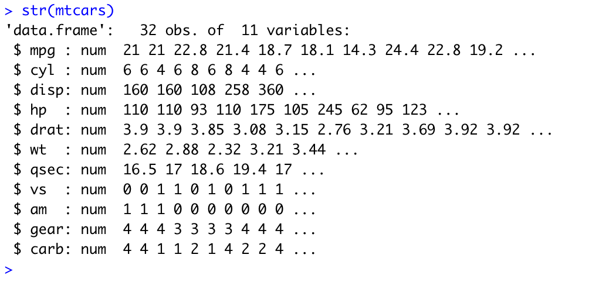

# R
R es un entorno y lenguaje de programación con un enfoque al análisis estadístico.

### Basic Commands (R Studio)

* Asignación de variables
    ```r
        x <- 86
    ```
* ver estructura de dataset (mtcars)
 
```r
    str(mtcars)
```
